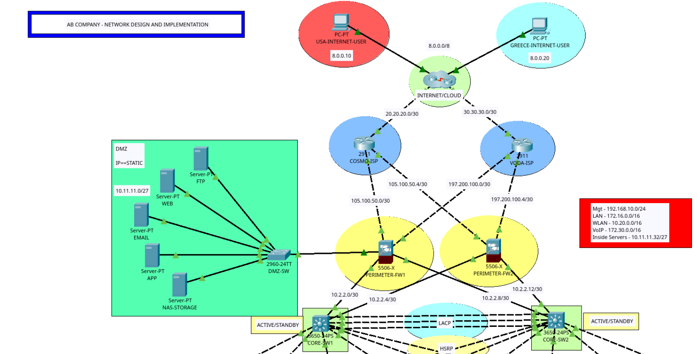
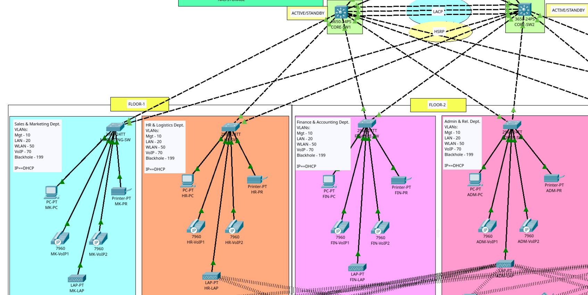
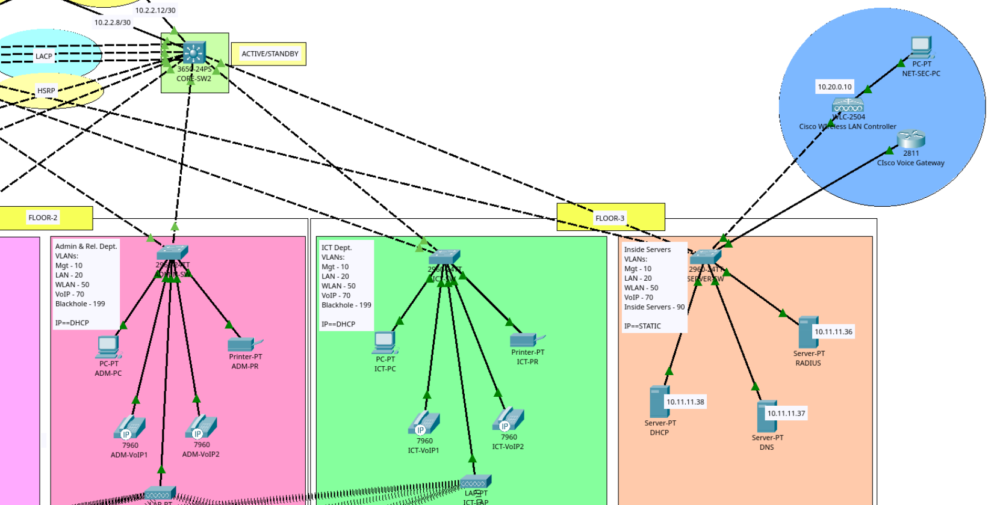
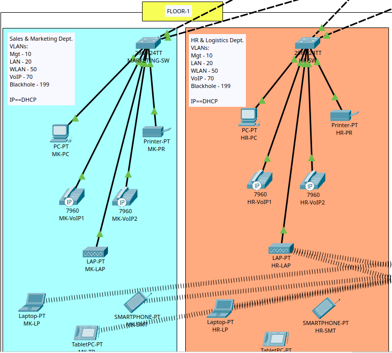
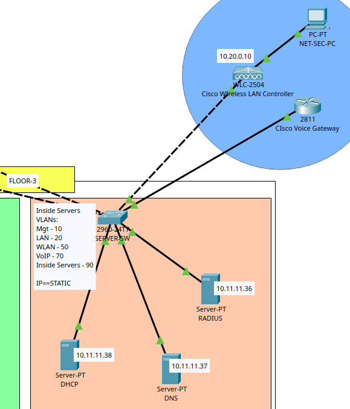
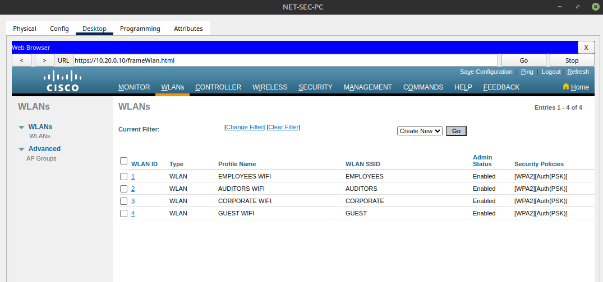

# enterprise-network-design

[](LICENSE.md)
<br />

## Description

> ### CCNA-level Enterprise Network Design built in Cisco Packet Tracer
<br />

This repository presents a comprehensive enterprise network 
design and implementation for a fictitious company, built 
entirely in Cisco Packet Tracer.

The project incorporates a wide range of CCNA-level concepts 
and real-world networking practices, including:

- Structured IP addressing scheme
- VLAN segmentation for Data, Voice, Wireless, DMZ and Management traffic.
- Static and dynamic (DHCP) addressing
- Etherchannel (LACP) for link aggregation
- HSRP for gateway redundancy
- Inter-VLAN routing
- Wireless LAN Controller (WLC) configuration with Lightweight APs
- OSPF dynamic routing and static routing

<br />
<br />

## Network Topology

<br />
<br />

***------------------------- WAN / DMZ / PERIMETER -------------------------***
<br />
<br />

<br />
<br />
***------------------------- INTERNAL NETWORK A -------------------------***
<br />
<br />

<br />
<br />
***------------------------- INTERNAL NETWORK B -------------------------***
<br />
<br />


<br />
<br />

*View the full network topology [here](resource_files/network-topology.png)* 

<br />

*You can download the packet tracer file [here](resource_files/network-topology.png)* 
<br />
<br />

## Configuration Breakdown


> *Expand each section to view the configuration commands*


<details>

<summary>Device Hardening & Secure Remote Access (SSH) Configuration</summary>
<br />
<br />

Core Switch 1

```
enable
configure terminal
hostname CORE1-SWITCH

line con 0
password demo
login
exec-timeout 3 0
logging synchronous
exit

enable secret random
banner motd #

***************************************
*      AUTHORIZED ACCESS ONLY         *
*     TRESPASSERS WILL BE SHOT        *
*    SURVIVORS WILL BE SHOT AGAIN!    *
*                                     *
***************************************

#
no ip domain-lookup
service password-encryption

username john secret coffey
ip domain-name ab.com
crypto key generate rsa general-keys modulus 1024
ip ssh version 2

line vty 0 15
login local
transport input ssh
exit

access-list 1 permit 192.168.10.0 0.0.0.255
access-list 1 deny any
line vty 0 15
access-class 1 in
exit 

do write memory

> The same configuration applies to Core Switch 2 — omitted for brevity...
...
...
```


</details>

<details>

<summary>IP Addressing and Subnetting</summary>

<br />
<br />

Core Switch 1
```
ip routing

int g1/0/1
no switchport
no shut
ip address 10.2.2.1 255.255.255.252

int g1/0/2
no switchport
no shut
ip address 10.2.2.5 255.255.255.252
exit
do write memory
```
Core Switch 2
```
ip routing

int g1/0/1
no switchport
no shut
ip address 10.2.2.13 255.255.255.252

int g1/0/2
no switchport
no shut
ip address 10.2.2.9 255.255.255.252
exit
do write memory

> The configuration of the other network devices is omitted for brevity...
...
...
```

</details>

<details>

<summary>Access Switches VLAN Configuration, Port Assignment & Security</summary>
<br />
<br />



```

int range f0/1 - 2
switchport mode trunk
no shut
exit

vlan 10
name MGT
vlan 20
name LAN
vlan 50
name WLAN
vlan 70
name VOIP
vlan 199
name BLACKHOLE
exit

int range f0/3-4
switchport mode access
switchport access vlan 20
no shut
exit

int range f0/5-6
switchport mode access
switchport voice vlan 70
no shut
exit

int range f0/7
switchport mode access
switchport access vlan 50
no shut
exit

int range f0/8 - 24, gig0/1-2
switchport mode access
switchport access vlan 199
no shut
exit

do wr


> The same configuration is applied to the rest of the Access Switches - omitted for brevity ...
...
...

```


</details>

<details>

<summary>Server Farm Switch VLAN Configuration & Port Assignment</summary>
<br />
<br />



```
int range f0/1 - 2, f0/7
switchport mode trunk
exit

vlan 10
name MGT
vlan 20
name LAN
vlan 50
name WLAN
vlan 70
name VOIP
vlan 90
name INSIDE-SERVERS
exit

int range f0/3-5
switchport mode access
switchport access vlan 90
exit

int f0/6
switchport mode access
switchport access vlan 50
exit

do wr
```

</details>

<details>

<summary>Core Switches VLAN Configuration & Port Assignment</summary>
<br />
<br />

```
int range g1/0/3-8
switchport mode trunk
exit

vlan 10
name MGT
vlan 20
name LAN
vlan 50
name WLAN
vlan 70
name VOIP
vlan 90
name INSIDE-SERVERS
exit
do wr
```

</details>

<details>

<summary>EtherChannel (LACP) & Trunk Configuration 
between Core Switches</summary>
<br />
<br />

Core Switch 1
```
int range g1/0/9-11
channel-group 1 mode active
int port-channel 1
switchport mode trunk
exit
do wr
```
Core Switch 2
```
int range g1/0/9-11
channel-group 1 mode passive
int port-channel 1
switchport mode trunk
exit
do wr
```

</details>

<details>

<summary>STP PortFast & BPDU Guard Configuration</summary>
<br />
<br />

Access Switches
```
int range f0/3-24
spanning-tree portfast
spanning-tree bpduguard enable
do wr
```

DMZ
```
int range f0/1-24
spanning-tree portfast
spanning-tree bpduguard enable
do wr
```

Server Farm Switch
```
int range f0/3-6, f0/8-24
spanning-tree portfast
spanning-tree bpduguard enable
do wr
```

</details>

<details>

<summary>Core Switches VLAN Interfaces, HSRP Gateway 
Redundancy & DHCP Helper Configuration</summary>
<br />
<br />

Core Switch 1
```
int vlan 10
ip address 192.168.10.3 255.255.255.0
standby 10 ip 192.168.10.1
ip helper-address 10.11.11.38

int vlan 20
ip address 172.16.0.3 255.255.0.0
standby 20 ip 172.16.0.1
ip helper-address 10.11.11.38

int vlan 50
ip address 10.20.0.2 255.255.0.0
standby 50 ip 10.20.0.1
ip helper-address 10.11.11.38

int vlan 90
ip address 10.11.11.34 255.255.255.224
standby 90 ip 10.11.11.33

exit
do write memory
```

Core Switch 2
```
int vlan 10
ip address 192.168.10.2 255.255.255.0
standby 10 ip 192.168.10.1
ip helper-address 10.11.11.38

int vlan 20
ip address 172.16.0.2 255.255.0.0
standby 20 ip 172.16.0.1
ip helper-address 10.11.11.38

int vlan 50
ip address 10.20.0.3 255.255.0.0
standby 50 ip 10.20.0.1
ip helper-address 10.11.11.38

int vlan 90
ip address 10.11.11.35 255.255.255.224
standby 90 ip 10.11.11.33

exit
do wr
```

</details>


<details>

<summary>OSPF Configuration on Core Switches</summary>
<br />
<br />

Core Switch 1
```
router ospf 35
router-id 1.1.1.1
network 10.2.2.0 0.0.0.3 area 0
network 10.2.2.4 0.0.0.3 area 0
network 192.168.10.0 0.0.0.255 area 0
network 172.16.0.0 0.0.255.255 area 0
network 10.20.0.0 0.0.255.255 area 0
network 10.11.11.32 0.0.0.31 area 0
exit
do wr
```
Core Switch 2
```
router ospf 35
router-id 1.1.2.2
network 10.2.2.8 0.0.0.3 area 0
network 10.2.2.12 0.0.0.3 area 0
network 192.168.10.0 0.0.0.255 area 0
network 172.16.0.0 0.0.255.255 area 0
network 10.20.0.0 0.0.255.255 area 0
network 10.11.11.32 0.0.0.31 area 0
exit
do wr
```

</details>

<details>

<summary>ISP & Internet Core OSPF Configuration</summary>
<br />
<br />

COSMO
```
router ospf 35
router-id 1.1.3.3
network 105.100.50.0 0.0.0.3
network 105.100.50.0 0.0.0.3 area 0
network 105.100.50.4 0.0.0.3 area 0
network 20.20.20.0 0.0.0.3 area 0
exit
do wr
```
<br />

VODA
```
Router(config)#router ospf 35
Router(config-router)#router-id 1.1.4.4
Router(config-router)#network 197.200.100.4 0.0.0.3 area 0
Router(config-router)#network 197.200.100.0 0.0.0.3 area 0
Router(config-router)#network 30.30.30.0 0.0.0.3 area 0
exit
do wr
```
<br />

INTERNET CORE
```
router ospf 35
router-id 1.1.5.5
network 20.20.20.0 0.0.0.3 area 0
network 30.30.30.0 0.0.0.3 area 0
network 8.0.0.0 0.255.255.255 area 0
ex
do wr
```

</details>

<details>

<summary>ASA Firewall — Interface Configuration & Security Levels</summary>
<br />
<br />

Firewall 2

```
hostname FWL2

int g1/3
ip address 10.2.2.14 255.255.255.252
nameif INSIDE1
security-level 100
no shut
exit

int g1/4
ip address 10.2.2.6 255.255.255.252
nameif INSIDE2
security-level 0
no shut
exit

int g1/1
no shut
ip address 105.100.50.6 255.255.255.252
nameif OUTSIDE1
security-level 0
no shut
exit

FWL2(config)#int g1/2
ip address 197.200.100.6 255.255.255.252
nameif OUTSIDE2
security-level 0
exit
no shut

write memory

> The same configuration principles are applied to Firewall 1 - omitted for brevity...
...
...
```

</details>


<details>

<summary>ASA Firewall Default Routing & OSPF Configurations</summary>
<br />
<br />

Firewall 1
```
route OUTSIDE1 0.0.0.0 0.0.0.0 105.100.50.1
route OUTSIDE2 0.0.0.0 0.0.0.0 197.200.100.1 70

router ospf 35
router-id 1.1.8.8
network 105.100.50.0 255.255.255.252 area 0
network 197.200.100.0 255.25
network 197.200.100.0 255.255.255.252 area 0
network 10.11.11.0 255.255.255.224 area 0
network 10.2.2.0 255.255.255.252 area 0
network 10.2.2.8 255.255.255.252 area 0
exit
wr mem
```
<br />

Firewall 2
```
route OUTSIDE2 0.0.0.0 0.0.0.0 197.200.100.5
route OUTSIDE1 0.0.0.0 0.0.0.0 105.100.50.5 70

router ospf 35
router-id 1.1.9.9
network 105.100.50.4 255.255.255.252 area 0
network 197.200.100.4 255.255.255.252 area 0
network 10.2.2.12 255.255.255.252 area 0
network 10.2.2.4 255.255.255.252 area 0
exit
write memory
```

</details>


<details>

<summary>ASA Firewall — NAT/PAT & Access Control List Configuration</summary>
<br />
<br />


Firewall 1
```
object network INSIDE1-OUTSIDE1
subnet 172.16.0.0 255.255.0.0
nat (INSIDE1, OUTSIDE1) dynamic interface

object network INSIDE2-OUTSIDE1
subnet 172.16.0.0 255.255.0.0
nat (INSIDE2, OUTSIDE1) dynamic interface

object network INSIDE1wl-OUTSIDE1wl
subnet 10.20.0.0 255.255.0.0
nat (INSIDE1, OUTSIDE1) dynamic interface

object network INSIDE2wl-OUTSIDE1wl
subnet 10.20.0.0 255.255.0.0
nat (INSIDE2, OUTSIDE1) dynamic interface
ex

object network INSIDE1-OUTSIDE2
subnet 172.16.0.0 255.255.0.0
nat (INSIDE1, OUTSIDE2) dynamic interface

object network INSIDE2-OUTSIDE2
subnet 172.16.0.0 255.255.0.0
nat (INSIDE2, OUTSIDE2) dynamic interface

object network INSIDE1wl-OUTSIDE2wl
subnet 10.20.0.0 255.255.0.0
nat (INSIDE1, OUTSIDE2) dynamic interface

object network INSIDE2wl-OUTSIDE2wl
subnet 10.20.0.0 255.255.0.0
nat (INSIDE2, OUTSIDE2) dynamic interface
ex

object network DMZ-OUTSIDE1
subnet 10.11.11.0 255.255.255.224
nat (DMZ,OUTSIDE1) dynamic interface 

object network DMZ-OUTSIDE2
subnet 10.11.11.0 255.255.255.224
nat (DMZ,OUTSIDE2) dynamic interface 
ex
wr mem

access-list RES extended permit icmp any any
access-list RES extended permit tcp any any eq 80
access-list RES extended permit tcp any any eq 53
access-list RES extended permit udp any any eq 53

access-group RES in interface DMZ
access-group RES in interface OUTSIDE1
access-group RES in interface OUTSIDE2

```
<br />

Firewall 2

```
object network INSIDE1-OUTSIDE1
 subnet 172.16.0.0 255.255.0.0
 nat (INSIDE1,OUTSIDE1) dynamic interface
 
object network INSIDE1-OUTSIDE2
 subnet 172.16.0.0 255.255.0.0
 nat (INSIDE1,OUTSIDE2) dynamic interface
 
object network INSIDE1wl-OUTSIDE1wl
 subnet 10.20.0.0 255.255.0.0
 nat (INSIDE1,OUTSIDE1) dynamic interface
 
object network INSIDE1wl-OUTSIDE2wl
 subnet 10.20.0.0 255.255.0.0
 nat (INSIDE1,OUTSIDE2) dynamic interface
 
object network INSIDE2-OUTSIDE1
 subnet 172.16.0.0 255.255.0.0
 nat (INSIDE2,OUTSIDE1) dynamic interface
 
object network INSIDE2-OUTSIDE2
 subnet 172.16.0.0 255.255.0.0
 nat (INSIDE2,OUTSIDE2) dynamic interface
 
object network INSIDE2wl-OUTSIDE1wl
 subnet 10.20.0.0 255.255.0.0
 nat (INSIDE2,OUTSIDE1) dynamic interface
 
object network INSIDE2wl-OUTSIDE2wl
 subnet 10.20.0.0 255.255.0.0
 nat (INSIDE2,OUTSIDE2) dynamic interface

access-list RES extended permit icmp any any
access-list RES extended permit tcp any any eq 80
access-list RES extended permit tcp any any eq 53
access-list RES extended permit udp any any eq 53

access-group RES in interface OUTSIDE1
access-group RES in interface OUTSIDE2
```

</details>

<details>

<summary>WLAN Configuration</summary>
<br />
<br />

WLANs were configured through the Cisco GUI

<br />



</details>

## Notes
<br />
- Certain configurations such as WLAN setup, static IP addressing and DHCP Server configuration, were performed through the respective device GUIs rather than the CLI.

## Usage
<br />
*You can download the packet tracer file [here](resource_files/network-topology.png)* 
<br />
To open the file, Cisco Packet Tracer needs to be installed.


